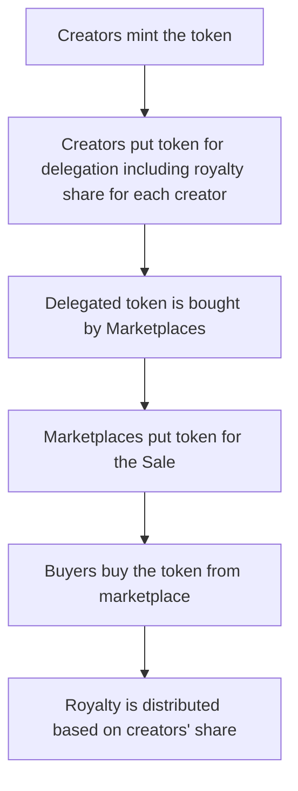

# cardano-royalties-contracts
## Description
This a smart contract example for **Royalties** developed using Plutus and Haskell 
during my internship period at [Sireto Tech](https://sireto.com/).
The royalty concepts implemented here are simple and similar to real life Books Royalty i.e Royalty amount is distributed only
once when the Marketplace sells the token minted by the creators.

The basic functionality goes like:

The contract has been run and tested in `EmulatorTrace`. 
